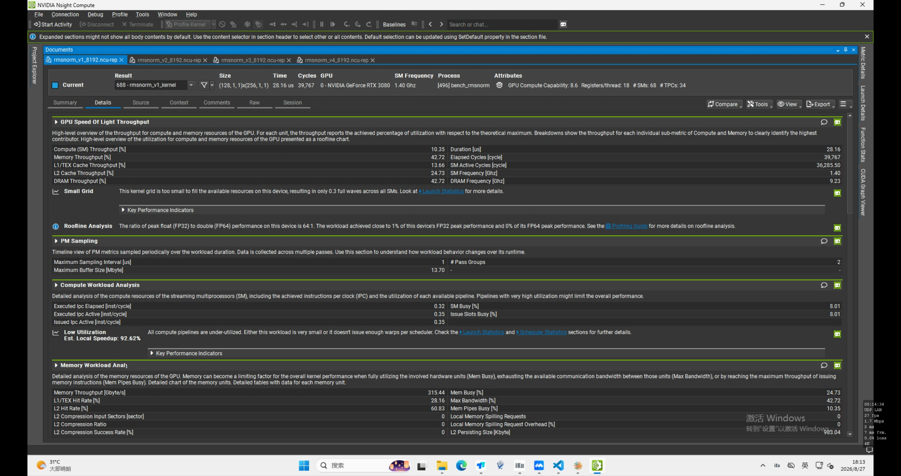
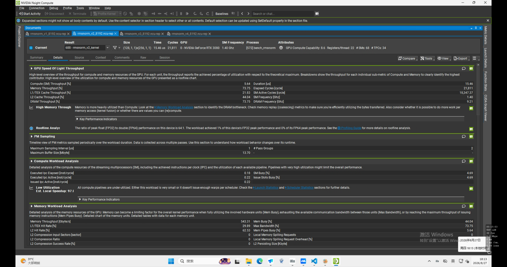
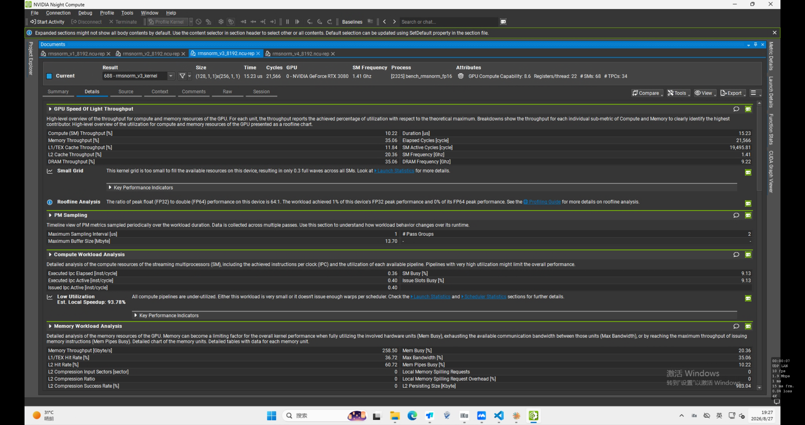
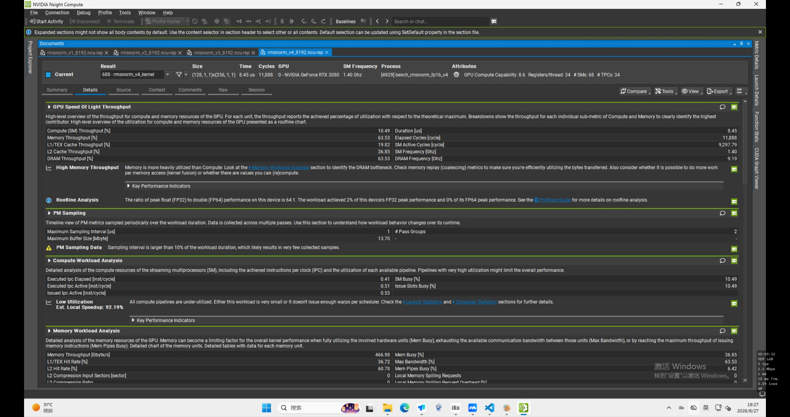

+++
title = 'MiniLLM-CUDA：RMSNorm 优化阶段分析（v0 → v4）'
date = 2026-08-27T00:00:00+09:00
draft = false
tags = ['CUDA', 'RMSNorm', 'Nsight Compute', '算子优化', 'FP16', '向量化']
+++

## 前言

这篇文章记录 RMSNorm 算子从 v0 到 v4 的完整优化过程，包括每个版本的实现思路、Benchmark 数据、以及 Nsight Compute 分析。

最终目标：

- 理解 RMSNorm 的 CUDA 实现
- 从 Shared Memory Reduction → Warp Shuffle → 向量化访存 → FP16，逐步优化
- 通过 Nsight Compute 定位瓶颈，验证优化方向

---

## 一、环境

- GPU：NVIDIA GeForce RTX 3080 × 2
- Compute Capability：8.6
- CUDA Toolkit：13.0
- Python：3.12
- PyTorch：2.12.1 + cu130
- Triton：3.7.1
- 编译参数：`-O3 -arch=sm_86`

---

## 二、RMSNorm 公式

对每一行输入 `x`：

$$
r = \frac{1}{\sqrt{\frac{1}{N}\sum_i x_i^2 + \epsilon}}
$$

最终输出：

$$
y_i = x_i \cdot r \cdot weight_i
$$

实现时采用：

- 一个 CUDA block 处理一行
- 一个 block 使用 256 threads
- 每个 thread 负责若干列
- reduction 用于求整行平方和

---

## 三、各版本实现思路

### v0：Shared Memory Reduction

- 每个线程计算自己的局部平方和
- 写入 `shared[256]`
- 使用树形 reduction：`256 -> 128 -> 64 -> ... -> 1`
- 每一轮使用 `__syncthreads()`

特点：实现直观，但 shared memory 访问和 block 级同步较多。

### v1：Warp Shuffle Reduction

- warp 内使用 `__shfl_down_sync()` 完成 reduction
- 256 threads = 8 warps
- 每个 warp 只向 shared memory 写入一个结果
- 最后由 warp 0 再完成一次 reduction

相比 v0：

- 减少 shared memory 访问
- 减少 `__syncthreads()`
- shared memory 从约 1024 Bytes 降到约 32 Bytes

### v2：FP32 + float4

在 v1 基础上增加向量化访存：

```cpp
float4
```

一次处理 `4 × FP32 = 16 Bytes`。

目标：

- 减少 load/store 指令数量
- 提高显存访问效率
- 提高实际 Memory Throughput

### v3：FP16 + half2 + FP32 Accumulate

数据类型：

```text
输入：FP16
weight：FP16
平方和累加：FP32
输出：FP16
```

使用 `half2` 一次处理两个 FP16。

核心思想：

```text
FP16 storage
    ↓
FP32 accumulate
    ↓
FP16 output
```

### v4：FP16 + 16-Byte Vectorized Access

v3 的 `half2` 一次只有 `2 × FP16 = 4 Bytes`。

v4 定义：

```cpp
struct alignas(16) Half8 {
    half data[8];
};
```

一次读取：

```text
8 × FP16 = 16 Bytes
```

从而同时保留：

- FP16 较低的数据量
- 16 Bytes 宽向量访存

当前实现要求 `hidden % 8 == 0`，否则回退到 v3。

---

## 四、FP32 Benchmark

`rows = 128`，`threads = 256`

| Version | Hidden | Latency (ms) | Max Error |
|---|---:|---:|---:|
| v0 | 512 | 0.010158 | 7.2e-7 |
| v1 | 512 | 0.010165 | 7.2e-7 |
| v2 | 512 | 0.010472 | 7.2e-7 |
| v0 | 1024 | 0.009750 | 7.2e-7 |
| v1 | 1024 | 0.009723 | 4.8e-7 |
| v2 | 1024 | 0.010053 | 4.8e-7 |
| v0 | 2048 | 0.010726 | 2.62e-6 |
| v1 | 2048 | 0.010909 | 2.62e-6 |
| v2 | 2048 | 0.009940 | 2.62e-6 |
| v0 | 4096 | 0.011343 | 1.67e-6 |
| v1 | 4096 | 0.011565 | 1.67e-6 |
| v2 | 4096 | 0.009873 | 1.67e-6 |
| v0 | 8192 | 0.027198 | 7.39e-6 |
| v1 | 8192 | 0.026863 | 7.39e-6 |
| v2 | 8192 | 0.017368 | 7.39e-6 |

观察：hidden 增大后，v2 的优势明显。hidden=8192 时，v1 为 26.863 us，v2 为 17.368 us，提升约 35%。

---

## 五、FP16 Benchmark

### v3：half2

| Hidden | Latency (ms) | Max Error |
|---:|---:|---:|
| 512 | 0.009955 | 0.00163651 |
| 1024 | 0.010136 | 0.00160170 |
| 2048 | 0.010489 | 0.00158429 |
| 4096 | 0.011160 | 0.00168157 |
| 8192 | 0.011651 | 0.00166559 |

### v4：Half8

| Hidden | Latency (ms) | Max Error |
|---:|---:|---:|
| 512 | 0.009649 | 0.00163651 |
| 1024 | 0.010796 | 0.00160170 |
| 2048 | 0.009610 | 0.00158429 |
| 4096 | 0.010240 | 0.00168157 |
| 8192 | 0.010296 | 0.00166559 |

hidden=8192：

```text
v3 = 11.651 us
v4 = 10.296 us
```

v4 相对 v3 再提升约 11.6%。

---

## 六、Nsight Compute：v1 vs v2

测试：`rows=128, hidden=8192, threads=256`

| Metric | v1 | v2 |
|---|---:|---:|
| Duration | 28.16 us | 15.46 us |
| Compute Throughput | 10.35% | 5.64% |
| Memory Throughput | 42.72% | 73.75% |
| DRAM Throughput | 42.72% | 73.75% |
| Memory Throughput | 315.44 GB/s | 543.31 GB/s |
| L1/TEX Throughput | 13.66% | 21.83% |
| L2 Throughput | 24.73% | 44.04% |
| Registers / Thread | 18 | 22 |





结论：v2 使用 `float4` 后，Memory Throughput 从 315 GB/s 提升到 543 GB/s，Duration 从 28.16 us 降到 15.46 us。RMSNorm 明显偏 memory-bound。

---

## 七、Nsight Compute：v3

hidden=8192：

| Metric | v3 |
|---|---:|
| Duration | 15.23 us |
| Compute Throughput | 10.22% |
| Memory Throughput | 35.06% |
| DRAM Throughput | 35.06% |
| Memory Throughput | 258.50 GB/s |
| L1/TEX Throughput | 11.84% |
| L2 Throughput | 20.36% |
| Registers / Thread | 22 |



观察：

- FP16 将数据量减半，显著降低显存压力
- v3 使用 `half2`，向量宽度只有 4 Bytes
- 同时增加 FP16 ↔ FP32 转换
- 因此继续设计 v4，以恢复 16 Bytes 宽向量访存

---

## 八、Nsight Compute：v4

测试：`rows=128, hidden=8192, threads=256`

| Metric | v3 | v4 |
|---|---:|---:|
| Duration | 15.23 us | 8.45 us |
| Compute Throughput | 10.22% | 10.49% |
| Memory Throughput | 35.06% | 63.53% |
| DRAM Throughput | 35.06% | 63.53% |
| Memory Throughput | 258.50 GB/s | 466.98 GB/s |
| L1/TEX Throughput | 11.84% | 19.82% |
| L2 Throughput | 20.36% | 36.85% |
| Registers / Thread | 22 | 34 |
| L1/TEX Hit Rate | 36.72% | 36.72% |
| L2 Hit Rate | 60.72% | 60.78% |



### 观察

v4 将 v3 的 `half2`（4 Bytes 宽访问）改为 `Half8`（16 Bytes 宽访问）。

结果非常明显：

```text
Duration
15.23 us -> 8.45 us

Memory Throughput
258.50 GB/s -> 466.98 GB/s

DRAM Throughput
35.06% -> 63.53%
```

说明 v4 的 16-Byte 向量化访问显著提高了内存系统利用效率。

Compute Throughput 基本没有变化：

```text
v3 = 10.22%
v4 = 10.49%
```

说明这次性能提升主要不是来自计算能力，而是来自更高效的访存。

Registers / Thread 从：

```text
22 -> 34
```

这是因为 `Half8` 需要同时保存更多 FP16/FP32 中间值。当前寄存器增加并没有抵消访存优化收益。

### v3 → v4 的关键结论

v3 已经通过 FP16 减少了数据总量，但 `half2` 一次只有 4 Bytes。

v4 保持 FP16 数据类型，同时恢复到 16 Bytes 宽访存：

```text
v3:
FP16 + half2
4 Bytes/vector access

v4:
FP16 + Half8
16 Bytes/vector access
```

因此 v4 同时获得：

- FP16 较低的数据搬运量
- 16-Byte 向量化访问
- FP32 accumulation 保证 reduction 精度

这是当前 RMSNorm 实现中效果最好的版本。

---

## 九、Small Grid 问题

Nsight Compute 对 v1/v2/v3 都提示 `Small Grid`。

当前：

```text
grid = 128 blocks
RTX 3080 = 68 SM
```

工作量较小，GPU 没有完全铺满。后续可以增加 rows，观察更大 workload 下的表现。

---

## 十、Benchmark 和 Nsight Compute 的区别

### CUDA Event Benchmark

回答：

> kernel 实际到底多快？

最终 latency 以 CUDA Event benchmark 为主。

### Nsight Compute

回答：

> 为什么快？瓶颈在哪里？

`--set full` 会进行多次 replay，对极短 kernel 会产生扰动，所以 NCU Duration 不应直接代替最终 benchmark latency。

---

## 十一、本阶段学到的 CUDA 技术

- Shared Memory Reduction
- Warp Shuffle Reduction
- `__shfl_down_sync()`
- `__syncthreads()`
- `float4`
- `half2`
- 16-byte vectorized access
- FP16 storage + FP32 accumulation
- CUDA Event Benchmark
- Nsight Compute
- Memory-bound kernel 分析
- tail / remainder 与向量化对齐问题

---

## 十二、RMSNorm 优化路线总结

```text
PyTorch Reference
        ↓
v0 Shared Memory Reduction
        ↓
v1 Warp Shuffle Reduction
        ↓
v2 FP32 + float4
        ↓
v3 FP16 + half2 + FP32 Accumulate
        ↓
v4 FP16 + Half8 (16B Vectorized Access)
```

当前 hidden=8192：

```text
v0 : 27.198 us
v1 : 26.863 us
v2 : 17.368 us
v3 : 11.651 us
v4 : 10.296 us
```

从 v0 到 v4：

```text
27.198 us -> 10.296 us
```

整体约提升 2.64×。

此外，Nsight Compute 显示 v4 相比 v3：

```text
NCU Duration:       15.23 us -> 8.45 us
Memory Throughput:  258.50 GB/s -> 466.98 GB/s
DRAM Throughput:    35.06% -> 63.53%
```

这进一步验证了 `Half8` 16-Byte 向量化访存的有效性。

---

## 十三、下一阶段：RoPE

下一算子：

```text
RoPE (Rotary Position Embedding)
```

计划继续采用：

```text
PyTorch reference
    ↓
CUDA baseline
    ↓
正确性测试
    ↓
Benchmark
    ↓
向量化 / FP16 优化
    ↓
Nsight Compute
```

RoPE 阶段重点学习：

- Q/K tensor layout
- head / position / dimension 索引
- sin / cos
- 成对维度旋转
- 向量化处理
- FP16
